# Basic tutorial of IceBro with screenshots

### Download and Run

The simplest way to download a folder from GitHub is dowload as zip by first clicking on the green Clone or Download button. You can download
just IceBro.exe, all the necessary files are embedded, but to get the example and documentation you might want the entire folder.

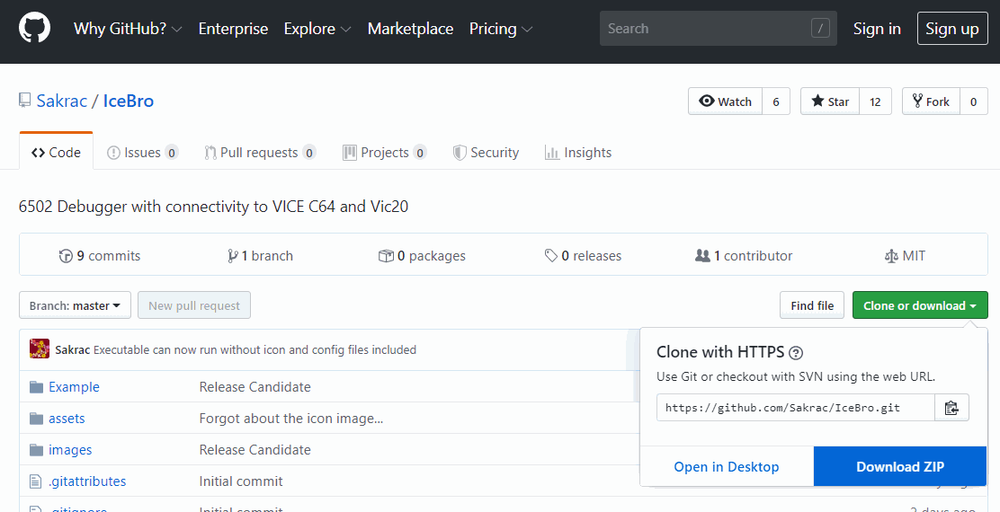

Just extract the files into a convenient folder

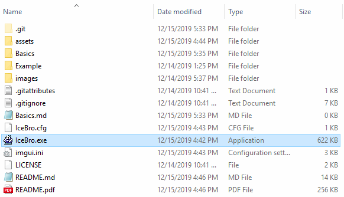

Just click IceBro.exe to begin, it should look like this the first time

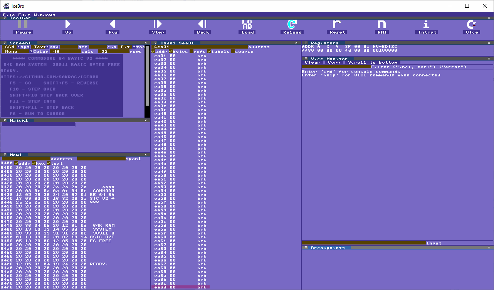

### Using IceBro without connecting to VICE

To try the example without VICE just click the LOAD icon to bring up the file dialog

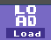

Select IceBro.prg and open it

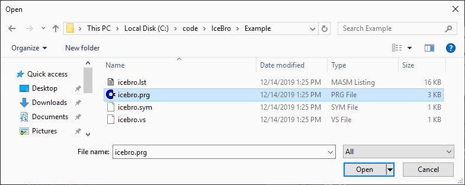

This is a PRG file so you don't need to specify a load address, just click OK.

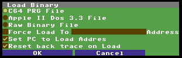

When loading a PRG file the debugger will first look for a .sym file with the same name to automatically load the symbols associated with the PRG file. If the .sym file can't be found it will look for a file of VICE monitor commands with the extension .vs and use those symbols instead.

Here is what you should see in the code view after loading the example

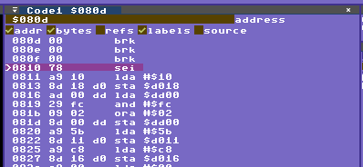

The symbols include a breakpoint so you can hit F5 or press the Play icon to run to the breakpoint.

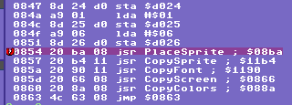

At this point you can go to the Screen view, set it to C64 and Current, which will show what the C64 should show on its screen. Next press
F10 to step over each jsr until you reach the jmp instruction.

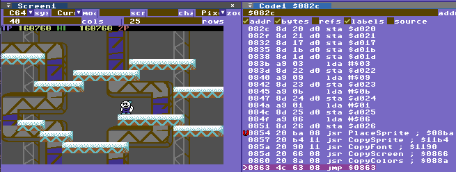

This is the full example using the debugger as a stand alone machine.

### The same example connected to VICE C64

You can restart the debugger for this example to clear out the result of the previous example.

The idea is to start VICE by itself and while it is starting up hit the C= icon in IceBro. Make sure IceBro is running and start VICE from the command line with the -remotemonitor and -moncommands options like this:

	\vice\x64sc.exe -remotemonitor -moncommands Example\icebro.vs Example\icebro.prg

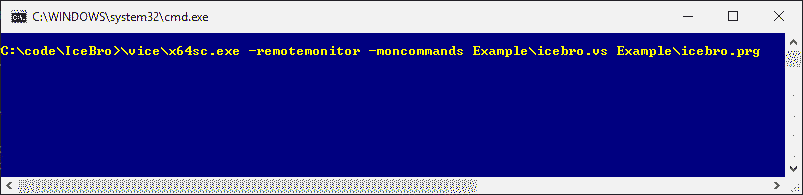

Immediately after hitting return and seeing VICE starting click the C= icon in IceBro to connect the debugger to VICE

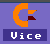

The monitor commands for VICE in the example contains a breakpoint so if everything works
VICE should pause at the same place as the example without running VICE.

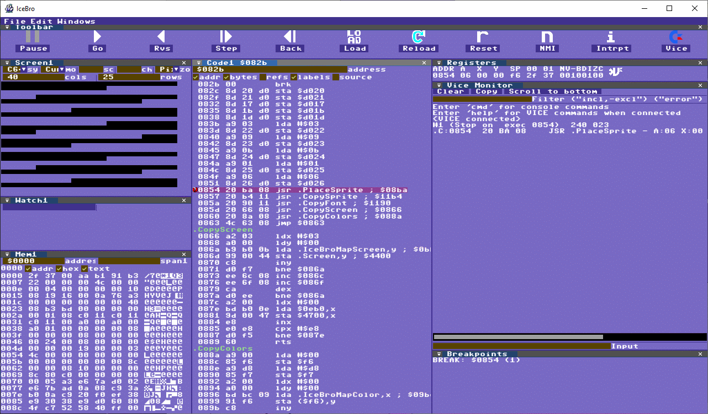

The screen mode is set up and you can press F10 to step in the debugger, or type X in the Vice Console to return to VICE then press the Pause Icon to pause VICE and return to the debugger. You can also type N into the debugger to step over in VICE but this requires you type type SYNC to update the debugger (otherwise the Vice Console feels too slow).

SYNC is also useful if you've started debugging but want to start over from the point VICE paused at, although in most cases you can just press Shift+F5 to reverse to to the same point.

While VICE is running you can press the pause icon at any time (or type PAUSE into the Vice Console) to pause VICE and return to the debugger

# Changing the layout

IceBro uses a Dock Space system to customize the layout, which is very useful for creating tools in the sense that I don't need to cater to specific use cases, and for users to be able to customize exactly how they prefer to work.

The concept is perhaps not intuitive but here are the basics. You don't need to close all the windows to rearrange them, but just to make the process easier to see I'm doing that to show the basics.

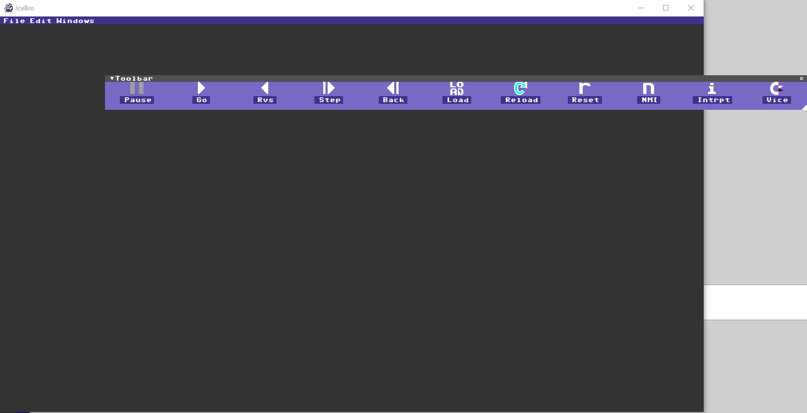

Closed windows can be reopened in the Windows menu bar, let's open the Vice Console

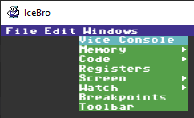

If you grab the title bar of the Vice Monitor and move it over the IceBro window you can see the docking achors shown, dropping the window over any of these anchors defines how the window will be fitted into the docking space.

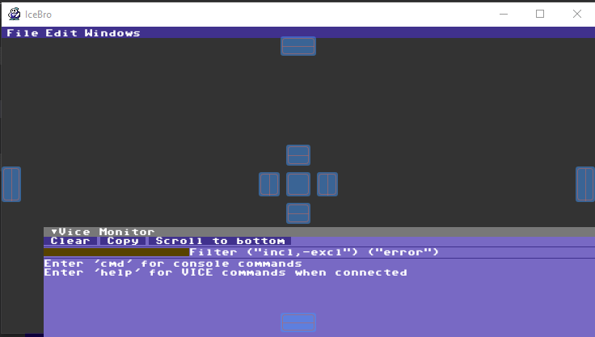

Let's drop the Vice Console on the center box which will make the Vice Console fill the entire Dock Space for now

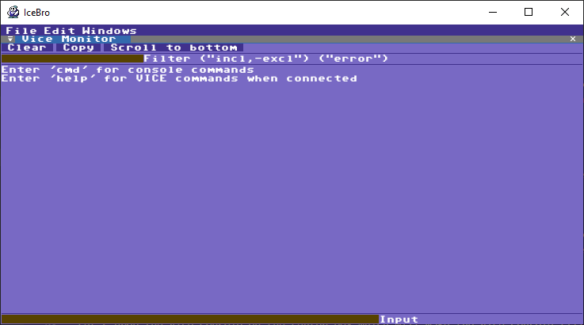

Next let's drop the Toolbar window on top of the Vice Console by dropping it on the box at the top of view Dock Space

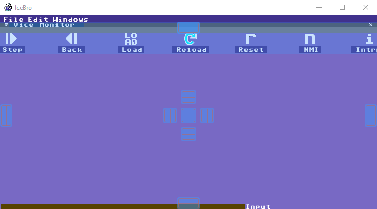

Next let's show one of the Code Views by selecing it from the Windows menu and releasing it over the box to the left of the center box in the Vice Console.

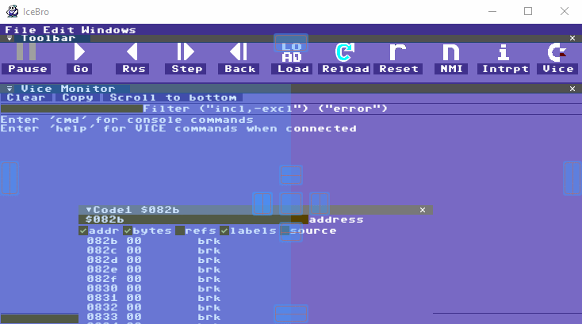

If you want to have more windows open than you have space for you can drop them in the center box of another window. This will create a tab in that window and you can quickly switch between the windows.

Note: If you delete the imgui.ini or IceBro.cfg files you will return to the default window arrangement. This can be useful if you get stuck and want to start over. The default layout files will be removed from IceBro in the future so you can keep your setup when upgrading.
