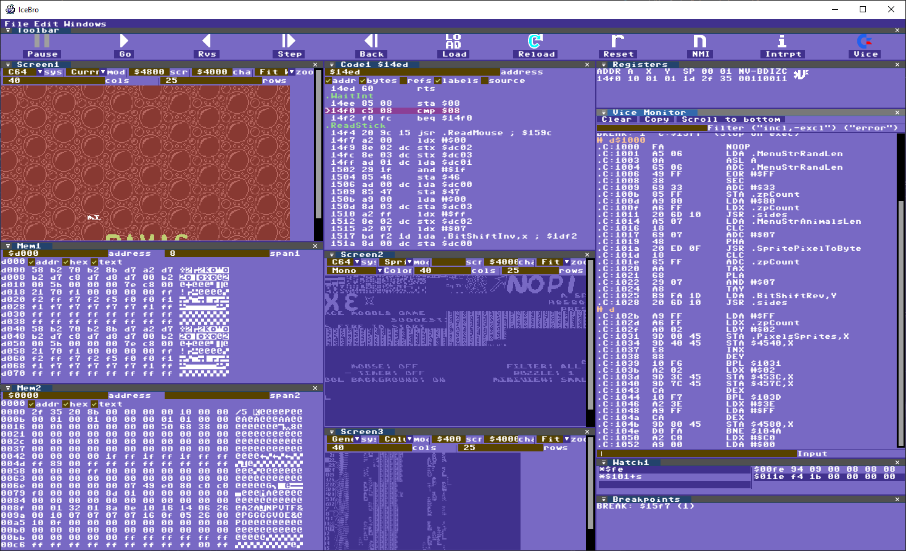
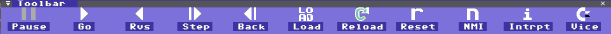
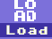
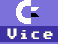
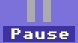

# IceBro preview 

The most recent documentation can be found at [github.com/sakrac/icebro](https://github.com/Sakrac/IceBro/blob/master/README.md)

## What is IceBro
At the core IceBro consists of a 6502 simulator with a graphical debugger around it.
Programs can be loaded into the simulator memory and executed but no other hardware
is simulated within the debugger.

To work with VICE the debugger can connect to a running
instance of VICE (C64 or Vic20) and copy the machine state
(RAM, CPU registers, labels and breakpoints)
when its monitor mode is enabled.

This means that the debugger is primarily looking at
the copy of the machine state,
and most debugging happens in the copied state.
The vice console commands still works with the VICE machine state.

This differs from a debugger that is working
directly with the machine state and
IceBro is not intended as a replacement for such debuggers.

Currently IceBro runs on 64 bit Windows systems, porting to other systems is possible, see below.

### In progress features

* Vic 20 Screen Modes
* Load a VICE Snapshot
* Multicolor Sprite Screen View
* Label Navigation View
* Unify the code style and systems so the source can be opened

### Name

Ice normally stands for an in-circuit emulator, or replacement
CPU for a system to allow more debugging. This isn't exactly that
but it is a cool concept. Bro relates to the connection to VICE.

## Acknowledgements

---

This tool is built using the Docking Branch of [Dear ImGui](https://github.com/ocornut/imgui) created by [Omar Cornut](https://twitter.com/ocornut).

ImGui Theme created by [MonstersGoBoom](https://twitter.com/MonstersGo).

---

VICE - the Versatile Commodore Emulator [vice-emu.sourceforge.net](http://vice-emu.sourceforge.net/)

VICE is a program that runs on a Unix, MS-DOS, Win32, OS/2, BeOS, QNX 4.x,
QNX 6.x, Amiga, Syllable or Mac OS X machine and executes programs intended for the old 8-bit computers. The current version emulates the C64, the C64DTV, the C128, the VIC20, practically all PET models, the PLUS4 and the CBM-II (aka C610/C510). An extra emulator is provided for C64 expanded with the CMD SuperCPU.

---

GLFW 3.2 - www.glfw.org

A library for OpenGL, window and input

Copyright (c) 2002-2006 Marcus Geelnard

Copyright (c) 2006-2010 Camilla Berglund <elmindreda@elmindreda.org>

This software is provided 'as-is', without any express or implied
warranty. In no event will the authors be held liable for any damages
arising from the use of this software.
Permission is granted to anyone to use this software for any purpose,
including commercial applications, and to alter it and redistribute it
freely, subject to the following restrictions:
1. The origin of this software must not be misrepresented; you must not
   claim that you wrote the original software. If you use this software
   in a product, an acknowledgment in the product documentation would
   be appreciated but is not required.
2. Altered source versions must be plainly marked as such, and must not
   be misrepresented as being the original software.
3. This notice may not be removed or altered from any source
   distribution.

---

Fonts in this package are(c) 2010 - 2014 Style.

This license is applicable to each font file included in this package in all their variants(ttf, eot, woff, woff2, svg).

You MAY NOT :
* sell this font; include / redistribute the font in any font collection regardless of pricing;
* provide the font for direct download from any web site, modify or rename the font.

You MAY :
* link to "http://style64.org/c64-truetype" in order for others to download and install the font;
* embed the font(without any modification or file renaming) for display on any web site using @font-face rules;
* use this font in static images and vector art;
include this font(without any modification or file renaming) as part of a software package but ONLY if said software package is freely provided to end users.
* You may also contact us to negotiate a(possibly commercial) license for your use outside of these guidelines at "http://style64.org/contact-style".
* At all times the most recent version of this license can be found at "http://style64.org/c64-truetype/license".

----

## Features

* Visualize the machine state in various views
* Run, step over, step into code, issue interrupts, etc.
* Step and run code backwards in roughly 5 million undo steps.
* Edit code and memory and update VICE state if connected
* Sync breakpoints, watch points and trace points with VICE
* Vice Console with extra commands to control the connection
* Visualize graphics in memory in a variety of ways

# Getting Started

You should be familiar with VICE C64 and how to use the built-in monitor
to get the most out of IceBro. The idea is to visualize things rather than
changing how to do things, to make debugging more effective rather than
dumb it down.

### Running an example without connecting to VICE

* Start the program and click the LOAD icon    in the toolbar, then load **IceBro.prg** from the **Example** folder.
* The "Load Binary" dialog should default to a **C64 PRG file** which is what you want,
so click **OK** to load it in.
* The debugger will identify that it is a basic program with a **SYS** command
and set the initial PC accordingly (if loading a **PRG** file to another memory location it will assume the load address is the start address).
* At this point you can step through the program with F10 (Step Over), F11 (Step Into) or just hit F5 to run it. Press the Pause Icon in the Toolbar to pause VICE.
* To check out source level debugging you can click **FILE** / **LOAD LISTING** from the drop down menu of the tool, select **Example/IceBro.lst** then in a code view enable the **SOURCE** checkbox.

### Running with VICE

* Start IceBro if you don't have it running already
* Run VICE with -remotemonitor and start IceBro.prg
* While VICE is starting click the VICE Connect icon once  in IceBro
* At any time when the program has loaded press the Pause icon  to enter monitor mode and IceBro will automatically sync the machine state from VICE.
* To return VICE to running mode just type X in the monitor, just like a VICE integrated monitor window.
* To exit VICE without exiting IceBro just type QUIT into the VICE Console window at any time it is connected.
* To disconnect IceBro from VICE press the VICE Connect icon again.

# Keyboard Reference
* Tab - Move current code window cursor to PC
* Shift+Tab - Set current code window cursor to PC
* F5 - Go
* F6 - Run to cursor in current code window
* F9 - Place breakpoint at cursor in current code window
* F10 - Step over
* F11 - Step into
* Shift+F5 Go reverse
* Shift+F10 Step over backwards
* Shift+F11 Step back
* Page up/down - Move several lines up/down in current code / memory window
* Cursor up/down - Move code cursor up/down in current code window

# Views

To show closed views go to the **Windows** main menu bar and select a view to open. Already opened views are marked with a checkmark.

### Vice Console

The Console combines the VICE Monitor with a few commands that are specific to IceBro. The VICE commands can be reviewed by typing help while the IceBro commands include:

* connect/cnct <ip>:<port> - connect to a remote host, default to 127.0.0.1:6510
* pause - pause VICE (same as pause icon in toolbar)
* font <size> - set font size 0-4
* sync - redo copy machine state from VICE (stepping in VICE doesn't sync for each command, also useful to restore the debugger to the current VICE state)
* eval <exp> - evaluate an expression
* history/hist - show previous commands
* clear - clear the console

### Code

There are four code views that can be displayed at any time. You can enter a value or an expression in the
address field. If you preface the expression with '=' the expression will be continously evaluated so for
example to show the call origin:

    ={$101+s}-2

Or the current interrupt:

    ={$fffe}

The checkboxes enables information in the code view, such as the address, bytes of the instructions etc.

* address - Show the address of each line
* bytes - Show the bytes of instructions
* refs - Show what the instruction refers to and the value it contains if relevant
* labels - Shows known labels, disable to see addresses
* source - If a valid listing is loaded show that for each represented line

The current PC is indicated by a '>', breakpoints are red broken circles in the leftmost column.

### Mem

Memory views shows bytes in RAM. You can specify the number of bytes in each line or clear it to show
as many bytes as fits in the view. The address field can be a value or an expression. Just like the code view an '=' prefixing the expression evaluates the expression constantly. For example to see the current stack:

    =$101+s

### Breakpoints

Currently there is no user interaction in the breakpoint window, use F9 in the Code View or break / watch in the Console View. The breakpoint view doesn't currently show traces, and the trace printing in the console is in progress at the moment. It works but will occasionally pause VICE, and it fills up the console really fast. If the console gets a bit unresponsive you can just clear it.

### Screen View

This is a view with a ton of options and one that I keep adding more and more options to but don't worry, it should be simple to set it up. You have up to four screens that can each show different things.

The Screen View has an option for different computers, for debugging C64 you probably want that option.

The easiest mode to use is C64/Current, it looks at memory in $d000 to draw what is the current screen with sprites. It is also fairly useless because hopefully it is what you seen in VICE (it only draws the sprites as of right now, no raster split sprites etc.). Make sure to set columns to 40 and rows to 25 to render correctly.

You can manually set screen modes and screen sizes as well, including Text,ExtText (ECM) and Bitmap. The Sprite view will show sprites in memory that fits into a screen with the dimensions of 8 pixel columns and rows. Sprite multicolor is in progress.

The Zoom feature allows you to customize how large the screen is drawn within the window.

### Watch View

The watch view is straightforward, click on a line on the left side and enter an expression. If an expression is prefixed with '*' it will show bytes at the address of the result of the expression.

If a part of an expression is enclosed in brackets ('[', ']') it will take the byte at the address within, and braces ('{', '}') will take a word (16 bit value) from an address.

For example, to see the bytes $fe/$ff points to:

    *{$fe}

To see what instruction is at an address use dis, this shows the first instruction of the current interrupt:

    dis {$fffe}

Or to see the current stack

    *$101+s

I'm still thinking about ways to rearrange expressions in the watch window but so far the easiest thing is to just edit IceBro.cfg while IceBro is closed.

### Register View

The Register View is trivial, you can click on any number in this view and change it. If you're connected to VICE you will see a VICE icon that is either crossed out or as it is. This lets you know if the values you edit in the registers will be updated in VICE as well. You can click the icon to switch this.

The reason for the icon is that if you're debugging something in the sandbox it is convenient to change flags and numbers to try things, but if the registers are not relevant to the current state in VICE you can mess up your code. Reflecting registers in VICE is automatically enabled after syncing with VICE and disabled when stepping or running in the sandbox.

# Expressions

Expressions are normal math expressions accepting labels and registers as values. The expressions are used
in various views including the Watch View, Mem and Code Views and also by the eval command in the Console view.
Valid operators include:

* Conditionals (eval to 0 or 1): ==, <, >, <=, >=, &&, ||
* Math: +, -, *, /
* Logical: &, |, ^ (xor), !
* Lookup bytes from memory: [addr] (byte), {addr} (word)
* Parenthesis: (, ) (controlling order of operations)

Registers include:

* PC, A, X, Y, S (stack), C, Z, I, D, V, N, FL (all flags as a byte)

Expresions are used for Screen, Mem, Watch, Code Views and the Eval command in the Console.

# Bugs, Requests, Suggestions and Comments

Please use the features at [github.com/sakrac/icebro](https://github.com/sakrac/icebro) to communicate your feedback. I will probably check on csdb.dk and twitter occasionally but it is easier to keep track of things in one place!

### Pull Requests

Once the project source is released I'm happy for any help, but please discuss any solution to fixing an issue you're considering with me first, just so I can coordinate and avoid duplicated solutions which I'm just now about to address myself after working on this codebase for a very long time...

### Other platforms

Dear ImGui and GLFW are built for supporting linux and apple but there are various systems I've implemented such as file dialogs, socks, threads and mutexes that will need some customization. Once the source is released and reasonably cleaned up I'd be happy for any help to add support for other platforms.